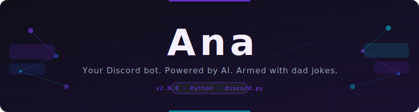
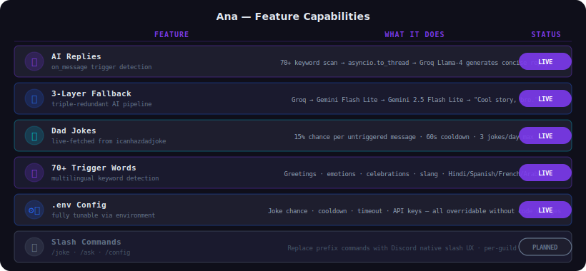
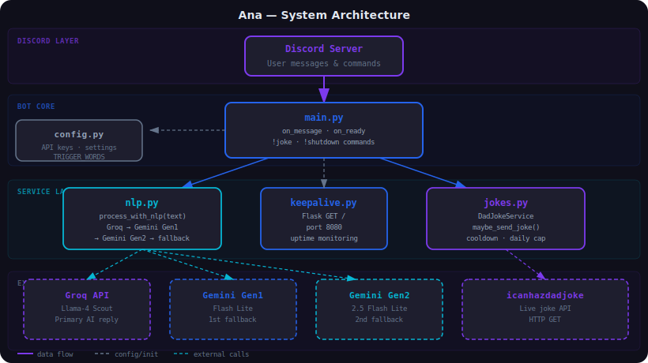
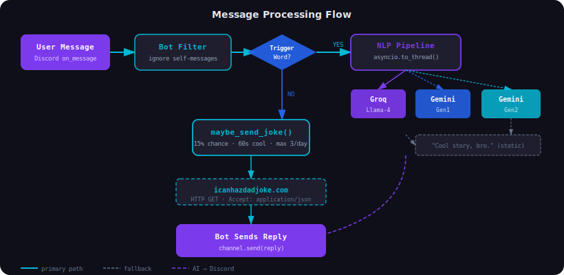
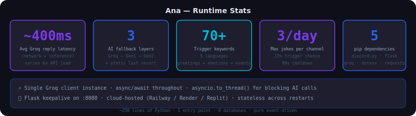

<div align="center">



</div>

**Your Discord bot. Powered by AI. Armed with dad jokes. Dangerous.**

[Features](#-features) • [Installation](#-installation) • [Usage](#-usage) • [Architecture](#%EF%B8%8F-architecture) • [Roadmap](#%EF%B8%8F-roadmap) • [License](#-license)

---

*I built Ana because I was tired of Discord bots that either do too much or say nothing interesting. She has one job: show up, generate a half-decent AI reply, and occasionally derail a serious conversation with a pun about cheese. It turns out that's exactly the right amount of bot.*

Ana is a Python Discord bot wired to three AI backends — Groq Llama-4 as the primary engine, with dual Gemini Flash Lite fallbacks so she keeps talking even when one API has a bad day. She scans every message for 70+ trigger words (greetings, moods, slang, multilingual phrases) and fires off a reply via `asyncio.to_thread` so the event loop never blocks. On untriggered messages she has a configurable 15% chance of dropping a live-fetched dad joke. A Flask keepalive on port 8080 lets uptime monitors confirm she hasn't rage-quit.

---

## Badges

<div align="center">


-06B6D4?style=for-the-badge)

</div>

---

## 🧠 System Overview

Ana is structured as a single async Python process: `main.py` owns the Discord client and routes incoming events; `nlp.py` runs the AI reply pipeline in a thread pool; `jokes.py` manages the dad-joke lifecycle with cooldown and daily cap; `keepalive.py` runs Flask in a background thread; and `config.py` loads everything from `.env` at startup.

```
Ana/
├── main.py          # Discord client, on_message, commands (!joke, !shutdown)
├── nlp.py           # AI pipeline: Groq → Gemini Gen1 → Gemini Gen2 → static
├── jokes.py         # DadJokeService: live fetch, 60s cooldown, 3/day cap
├── config.py        # .env loader, JokeSettings dataclass, TRIGGER_WORDS tuple
├── keepalive.py     # Flask GET / → "Bot is alive!" on :8080
├── requirements.txt # 5 pip dependencies
├── assets/          # SVG diagrams referenced by this README
└── wiki/            # Extended documentation
```

See the full architectural diagram below.

---

## ✨ Features

| Feature | What it actually does |
|---|---|
| 🤖 **AI Replies** | Trigger-word scan → `asyncio.to_thread` → Groq Llama-4 generates a short, casual reply without blocking the event loop |
| 🔄 **Fallback Chain** | Groq times out or errors? Gemini Flash Lite Gen1 takes over. That fails? Gen2. That fails? Static string. Zero silent failures. |
| 😂 **Dad Jokes** | Live HTTP GET to `icanhazdadjoke.com` on untriggered messages. 15% roll, 60s cooldown, max 3 per day per channel. |
| 🎯 **70+ Trigger Words** | Greetings, emotions, celebrations, cultural holidays, and slang — including Hindi, Spanish, French, and Arabic phrases |
| ⚙️ **Fully Configurable** | `JOKE_CHANCE`, `JOKE_COOLDOWN`, `JOKE_FETCH_TIMEOUT`, all API keys — every runtime value overridable via `.env` |
| 🌐 **Keepalive Server** | Flask endpoint at `GET /` returns `Bot is alive!` so Railway/Render/UptimeRobot don't think she's gone dark |
| 🛑 **`!shutdown`** | Owner-only. Prints a four-line dramatic farewell sequence with 1.5s pauses, then closes cleanly. |
| 🎤 **`!joke`** | Force-fetches a dad joke on demand, bypassing the probability and cooldown. Use sparingly. |

---

## 📊 Capability Visualization

<div align="center">



</div>

---

## 🏗️ Architecture

<div align="center">



</div>

Ana runs as a **single Python process** with two concurrent execution contexts: the `discord.py` async event loop handles all Discord I/O and command dispatch, while Flask runs in a separate daemon thread for the keepalive endpoint. AI calls in `nlp.py` are deliberately synchronous (Groq and Google SDKs) and are offloaded to the default thread pool executor via `asyncio.to_thread()` — this keeps latency-sensitive Discord events from waiting on an HTTP round-trip to an inference API.

The triple-fallback design exists because free-tier AI APIs have unpredictable availability. Rather than crashing or going silent on an API error, each provider is wrapped in a try/except that immediately hands off to the next. The static fallback at the end means Ana *always* says something, even if that something is "Cool story, bro." — which, depending on the conversation, might be the most accurate response anyway.

---

## 🌊 Data Flow

<div align="center">



</div>

Primary data path through a triggered message:

```
Discord on_message
  └─ content.lower() checked against TRIGGER_WORDS tuple
       ├─ MATCH → asyncio.to_thread(process_with_nlp, content)
       │            ├─ Groq(Llama-4)       → reply  ✓ done
       │            ├─ Gemini Gen1         → reply  ✓ done (if Groq failed)
       │            ├─ Gemini Gen2         → reply  ✓ done (if Gen1 failed)
       │            └─ "Cool story, bro."  → reply  (all APIs failed)
       │          └─ channel.send(reply)
       └─ NO MATCH → maybe_send_joke()
                       ├─ random() > 0.15 or cooldown active → skip
                       └─ GET icanhazdadjoke.com → channel.send(joke)
```

---

## 🚀 Installation

### Prerequisites

- **Python 3.10+** — `asyncio.to_thread` requires 3.9+; 3.10+ recommended for match-statement compatibility if you extend Ana
- **Discord bot token** — [Discord Developer Portal](https://discord.com/developers/applications). Enable "Message Content Intent" or she can't read messages.
- **Groq API key** — [console.groq.com](https://console.groq.com). Free tier works. Ana uses `llama-4-scout-17b-16e-instruct`.
- **Google AI API key(s)** — [aistudio.google.com](https://aistudio.google.com). Two separate keys (`GEN1_API_KEY`, `GEN2_API_KEY`) for the two Gemini fallbacks. You can use the same key value for both if you're fine with them sharing quota — just set both variables to the same string in `.env`.

### Steps

1. Clone the repo:
   ```bash
   git clone https://github.com/Kaelith69/Ana.git
   cd Ana
   ```

2. Install dependencies (5 packages — `discord.py`, `flask`, `groq`, `python-dotenv`, `requests`):
   ```bash
   pip install -r requirements.txt
   ```

3. Create your `.env`:
   ```bash
   cp .env.example .env   # or create it manually
   ```

4. Fill in `.env`:
   ```env
   # Required
   DISCORD_TOKEN=your_discord_bot_token_here
   GROQ_API_KEY=your_groq_api_key_here

   # Optional — Gemini fallbacks (bot works without them, just noisier failures)
   GEN1_API_KEY=your_gemini_gen1_api_key_here
   GEN2_API_KEY=your_gemini_gen2_api_key_here

   # Optional tuning (defaults shown)
   JOKE_CHANCE=0.15          # 0.0-1.0 probability per untriggered message
   JOKE_COOLDOWN=60          # Seconds between jokes in the same channel
   JOKE_FETCH_TIMEOUT=8      # HTTP timeout for icanhazdadjoke.com
   ```

5. Run:
   ```bash
   python main.py
   ```

> **Pro tip:** If you're hosting on Railway or Render, set env vars in their dashboard rather than a `.env` file. The keepalive server on `:8080` will automatically satisfy their health-check requirements without any extra config.

---

## 📖 Usage

### Primary workflow

1. Add Ana to your server with `bot` scope and `Send Messages` + `Read Message History` permissions
2. Make sure **Message Content Intent** is enabled in the Developer Portal (Applications → Bot → Privileged Gateway Intents)
3. Say anything containing a trigger word — Ana replies within ~400ms on a good day
4. Watch her silently judge untriggered messages and occasionally drop a pun

### Commands

| Command | Who can use it | What happens |
|---|---|---|
| `!joke` | Everyone | Live-fetches a dad joke, bypasses cooldown and daily cap |
| `!shutdown` | Bot owner only | Four-line dramatic farewell → `bot.close()` → `sys.exit(0)` |

### Trigger words

```
ana · hello · hi · hey · yo · sup
morning · gm · gn · goodmorning · goodnight · afternoon · evening
namaste · hola · bonjour
happy · sad · tired · angry · bored · excited
lmao · omg · wow · bruh
birthday · hbd · congrats · congratulations · bestwishes
wedding · engagement · diwali · christmas · eid · newyear · valentines
bye · goodbye · cya · later · seeya
... and ~30 more in config.py
```

> **Pro tip:** Add your server's memes or nicknames to `TRIGGER_WORDS` in `config.py`. The tuple is evaluated once at startup, so a restart is all it takes.

---

## 📁 Project Structure

```
Ana/
├── 🐍 main.py          # Entry point. Discord client setup, on_message routing,
│                       # !joke and !shutdown command handlers, asyncio glue
├── 🧠 nlp.py           # process_with_nlp(): Groq → Gemini Gen1 → Gemini Gen2
│                       # → static fallback. Each stage in its own try/except.
├── 😂 jokes.py         # DadJokeService class. random_joke() fetches live from
│                       # icanhazdadjoke.com. maybe_send_joke() enforces cooldown
│                       # and daily cap (max 3/channel/day).
├── ⚙️  config.py        # load_dotenv() + typed env helpers. JokeSettings frozen
│                       # dataclass. TRIGGER_WORDS tuple. Warns on missing keys.
├── 🌐 keepalive.py     # Flask app. GET / → 200 "Bot is alive!". Runs in a
│                       # daemon Thread so it doesn't block the event loop.
├── 📦 requirements.txt # discord.py · flask>=3 · python-dotenv · requests · groq
├── 🔒 .env             # NOT committed. Your API keys live here.
├── 📄 .gitignore       # .env · __pycache__ · *.pyc · venv/
├── 📜 LICENSE          # MIT
├── 📝 CHANGELOG.md     # Version history
├── 🤝 CONTRIBUTING.md  # How to contribute
├── 🔐 SECURITY.md      # Security policy
└── 🗂️  assets/          # SVG diagrams (hero-banner, architecture, data-flow,
                        # capabilities, stats)
```

---

## 📈 Performance Stats

<div align="center">



</div>

---

## 🔒 Privacy

Ana processes messages **only when triggered** — she's not reading everything in silence (unlike that one friend who screenshots your whole server).

- ✅ Messages processed only when they contain a **trigger word**
- ✅ No messages stored, logged, or persisted to disk
- ✅ API calls to Groq/Gemini include only the triggering message content, truncated to 1000 characters
- ✅ `.env` is gitignored — your API keys stay on your machine
- ❗ Groq and Google handle their respective API traffic under their own privacy policies

---

## 🗺️ Roadmap

**Conversations:**
- [ ] Memory/context — multi-turn so Ana doesn't forget she just answered this
- [ ] Per-server personality config — server admins set her vibe

**Commands:**
- [ ] Slash commands — `/joke`, `/ask`, `/config` (prefix commands are fine but dated)
- [ ] Rate limiting per user — stop one person from interrogating her all shift

**Jokes:**
- [ ] Async joke pre-fetching — background loop so `!joke` responds instantly
- [ ] Joke categories — opt into puns, anti-jokes, one-liners

**Triggers:**
- [ ] Custom trigger words per server — admins add their own keywords
- [ ] More trigger categories — weather, sports, coding questions

**Ops:**
- [ ] Logging dashboard — see what Ana's been saying (with privacy controls)
- [ ] Docker image — one-command deploy without touching Python env

---

## 📦 Packaging

To run Ana as a standalone process on a cloud platform (Railway, Render, Fly.io):

```bash
# No build step needed — pure Python, no compiled extensions
pip install -r requirements.txt
python main.py
```

The Flask keepalive server auto-starts on port `8080`. Set `PORT=8080` as an environment variable if your platform expects a specific port binding. Ana doesn't need a `Procfile` or `Dockerfile` — a plain `python main.py` start command is enough.

---

## 🤝 Contributing

Open an issue first for anything substantial. For typos and doc fixes, a PR is fine directly. See [CONTRIBUTING.md](CONTRIBUTING.md) for the full process.

---

## 🔐 Security

Found something? See [SECURITY.md](SECURITY.md) for the responsible disclosure process. Don't post API keys in issues.

---

## 📄 License

MIT © 2025 [Kaelith69](https://github.com/Kaelith69)

Go nuts. Just don't blame us when your Discord server becomes 40% dad jokes.

---

<div align="center">

*Made with ☕, questionable sleep habits, and an irrational love for fallback chains.*

</div>
