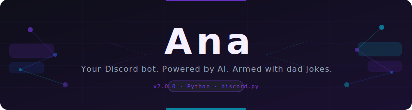
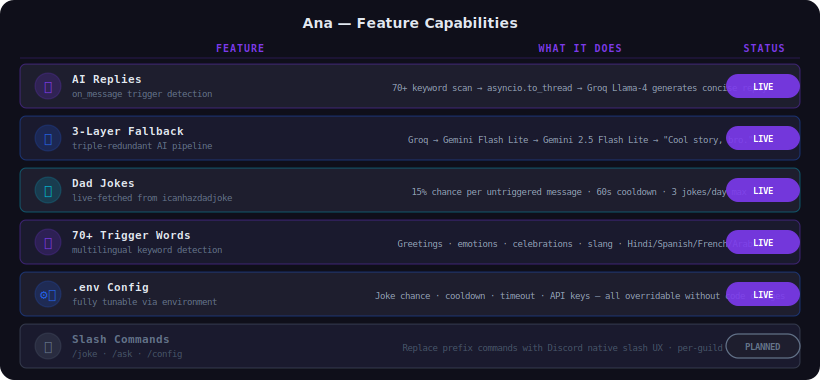
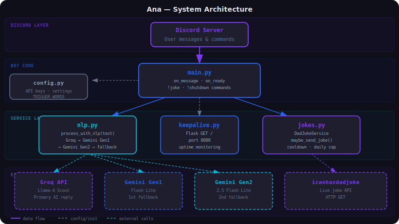
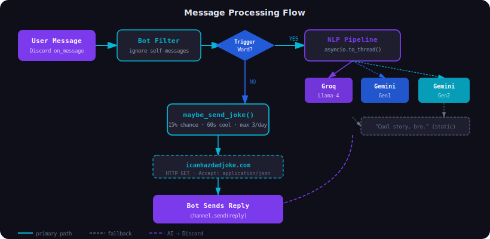
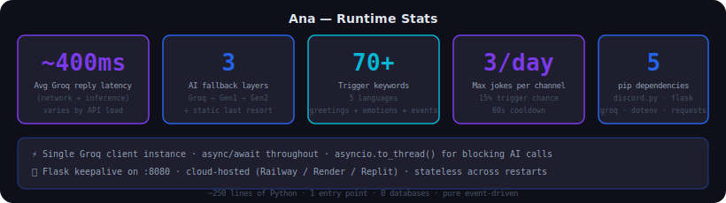

<div align="center">



</div>

**Your Discord bot. Powered by AI. Indistinguishable from a real member. Dangerous.**

[Features](#-features) • [Commands](#-commands) • [Installation](#-installation) • [Usage](#-usage) • [Architecture](#%EF%B8%8F-architecture) • [Raspberry Pi](#-raspberry-pi-autostart) • [Roadmap](#%EF%B8%8F-roadmap) • [License](#-license)

---

*Ana started as a simple AI reply bot. She's grown into something that regularly fools people into thinking there's a real, very online, chaotic 20-something in the server. She has opinions. She fires back when insulted. She flirts. She gets distracted mid-thought. She's the bit.*

Ana is a Python Discord bot wired to three AI backends — Groq Llama-4 as the primary engine, with dual Gemini Flash fallbacks. She's built to be indistinguishable from a human server member: proportional typing delays, occasional typo-then-correction, a distinct roast mode that bypasses all cooldowns when someone's being rude, a flirt mode with improvised NSFW-capable pick-up lines, emoji reactions, unprompted follow-up messages, and a conversation history window so she remembers what was just said. On untriggered messages she has a configurable 15% chance of dropping a live-fetched dad joke. A Flask keepalive on port 8080 keeps her alive on any hosting platform.

---

## Badges

<div align="center">


-06B6D4?style=for-the-badge)

</div>

---

## 🧠 System Overview

Ana is structured as a single async Python process: `main.py` owns the Discord client and routes all events; `nlp.py` runs the AI reply pipeline (with per-mode prompts and a deterministic `post_process()` that strips every AI artefact); `jokes.py` manages the dad-joke lifecycle; `keepalive.py` runs Flask in a daemon thread; and `config.py` loads everything from `.env` at startup.

```
Ana/
├── main.py             # Discord client, on_message, commands (!joke, !shutdown)
├── nlp.py              # AI pipeline: Groq → Gemini Gen1 → Gemini Gen2 → static
├── jokes.py            # DadJokeService: live fetch, 60s cooldown, 3/day cap
├── config.py           # .env loader, JokeSettings, TRIGGER/ROAST/FLIRT_WORDS
├── keepalive.py        # Flask GET / → "Bot is alive!" on :8080
├── requirements.txt    # 5 pip dependencies
├── .env.example        # Template — copy to .env and fill in your keys
├── setup_autostart.sh  # One-shot Raspberry Pi systemd setup script
├── assets/             # SVG diagrams referenced by this README
└── wiki/               # Extended documentation
```

---

## ✨ Features

| Feature | What it actually does |
|---|---|
| 🤖 **AI Replies** | Trigger-word scan → `asyncio.to_thread` → Groq Llama-4 generates a short, casual reply without blocking the event loop |
| 🔄 **Triple Fallback** | Groq down? → Gemini Flash Gen1. That down? → Gemini Flash Gen2. All fail? → human-sounding static fallback. Zero silent failures. |
| 🔥 **Roast Mode** | Insult or mock her and she fires back instantly — bypasses all cooldowns, fast angry typing (0.4–1.2s), 25% chance of a follow-up cutting remark |
| 💘 **Flirt Mode** | Flirt with her and she responds with an improvised, original pick-up line — bold, cheeky, NSFW-capable; never the same tired one-liners |
| 🎭 **Human Behaviour** | Proportional typing delays • occasional typo + star-correction • emoji-only reactions (12% of the time) • unprompted follow-up afterthoughts • conversation history window |
| 🧹 **AI Artefact Stripping** | `post_process()` deterministically removes markdown, AI opener phrases ("Sure,", "Of course,"), trailing periods, and capital first letters from every reply |
| 💬 **Conversation History** | Per-channel sliding window of last 10 messages passed as context to every AI call — she remembers what was just said |
| 😂 **Dad Jokes** | Live HTTP GET to `icanhazdadjoke.com` on untriggered messages. 15% roll, 60s cooldown, max 3 per day per channel |
| 🎯 **100+ Trigger Words** | Greetings, emotions, celebrations, cultural holidays, Gen-Z slang, multilingual phrases, roast words, and flirt words — all configurable |
| ⚙️ **Fully Configurable** | `JOKE_CHANCE`, `JOKE_COOLDOWN`, `SYSTEM_PROMPT`, all API keys — every runtime value overridable via `.env` |
| 🌐 **Keepalive Server** | Flask endpoint at `GET /` returns `Bot is alive!` so Railway/Render/UptimeRobot health checks pass |
| 🔒 **Cooldown System** | Per-user 25s cooldown + per-channel 7s cooldown prevent spam; roasts always go through regardless |
| 🍓 **Raspberry Pi Ready** | `setup_autostart.sh` installs a systemd service in one command — auto-starts on every reboot, waits for network, restarts on crash |

---

## 📊 Capability Visualization

<div align="center">



</div>

---

## 💬 Commands

Ana uses the `!` prefix for explicit commands.

| Command | Who | What happens |
|---|---|---|
| `!joke` | Everyone | Live-fetches a fresh dad joke from `icanhazdadjoke.com`, bypassing cooldown and daily cap |
| `!shutdown` | Bot owner only | Ana says a quick casual goodbye, then closes cleanly |

### `!joke` example
```
You:  !joke
Ana:  Why don't scientists trust atoms? Because they make up everything.
```

### `!shutdown` example
```
You:  !shutdown
Ana:  okay fine i'm going
Ana:  don't miss me too much lol
Ana:  bye i guess 💀
Ana:  ...
[Bot goes offline]
```

> **Who is the bot owner?** The Discord account that created the application in the Developer Portal. `discord.py`'s `@commands.is_owner()` handles this automatically — no config needed.

---

## 🏗️ Architecture

<div align="center">



</div>

Ana runs as a **single Python process** with two concurrent execution contexts: the `discord.py` async event loop handles all Discord I/O and command dispatch, while Flask runs in a separate daemon thread for the keepalive endpoint. AI calls in `nlp.py` are deliberately synchronous (Groq and Google SDKs) and are offloaded to the default thread pool executor via `asyncio.to_thread()` — this keeps latency-sensitive Discord events from waiting on an HTTP round-trip to an inference API.

The triple-fallback design exists because free-tier AI APIs have unpredictable availability. Rather than crashing or going silent on an API error, each provider is wrapped in a try/except that immediately hands off to the next. The static fallback at the end means Ana *always* says something, even if that something is "Cool story, bro." — which, depending on the conversation, might be the most accurate response anyway.

---

## 🌊 Data Flow

<div align="center">



</div>

Primary data path through a triggered message:

```
Discord on_message
  └─ Ignore bots / handle ! commands
       └─ Detect is_roast / is_flirt / is_trigger
            │
            ├─ ROAST ──► bypass ALL cooldowns
            │              → process_with_nlp(roast=True)    [temp 1.3/1.4]
            │              → post_process() strips AI artefacts
            │              → fast reply (0.4–1.2s typing delay)
            │              → 25% chance of _ROAST_FOLLOWUPS
            │
            ├─ FLIRT ──► normal cooldowns apply
            │              → process_with_nlp(flirt=True)
            │              → post_process()
            │              → 20% chance of _FLIRT_FOLLOWUPS
            │
            ├─ TRIGGER ► cooldown checks
            │    ├─ 12% chance → emoji reaction only
            │    ├─ 4%  chance → send with typo → send *correction
            │    └─ process_with_nlp()  [Groq → Gemini Gen1 → Gen2 → static]
            │              → post_process()
            │              → proportional typing delay (0.8–5.0s)
            │              → 8% chance of _FOLLOWUPS
            │
            └─ NO TRIGGER → maybe_send_joke()
                              ├─ cooldown / rand / daily-cap → skip
                              └─ GET icanhazdadjoke.com → channel.send(joke)
```

---

## 🚀 Installation

### Prerequisites

- **Python 3.10+** — check with `python --version`
- **Discord bot token** — [Discord Developer Portal](https://discord.com/developers/applications). Enable **Message Content Intent** or Ana can't read messages.
- **Groq API key** — [console.groq.com](https://console.groq.com). Free tier works. Uses `llama-4-scout-17b-16e-instruct`.
- **Google AI API key(s)** — [aistudio.google.com](https://aistudio.google.com). Two keys for fallbacks (`GEN1_API_KEY`, `GEN2_API_KEY`). You can use the same value for both to share quota.

### Steps

1. Clone the repo:
   ```bash
   git clone https://github.com/Kaelith69/Ana.git
   cd Ana
   ```

2. Create a virtual environment and install dependencies:
   ```bash
   python -m venv .venv
   source .venv/bin/activate   # Linux / macOS / Raspberry Pi
   .venv\Scripts\activate      # Windows
   pip install -r requirements.txt
   ```

3. Create your `.env` from the provided template:
   ```bash
   cp .env.example .env
   ```

4. Fill in `.env` — open it and replace the placeholder values:
   ```env
   DISCORD_TOKEN=your_discord_bot_token_here
   GROQ_API_KEY=your_groq_api_key_here
   GEN1_API_KEY=your_gemini_api_key_here
   GEN2_API_KEY=your_gemini_api_key_here   # can be the same key as GEN1
   ```

5. Run:
   ```bash
   python main.py
   ```
   You should see: `✅ Logged in as Ana#1234`

---

## 🍓 Raspberry Pi Autostart

Run Ana automatically on every reboot with one command. The included `setup_autostart.sh` script handles the entire setup — virtual environment, dependencies, and a systemd service that starts after the network is ready and auto-restarts on crash.

```bash
chmod +x setup_autostart.sh && ./setup_autostart.sh
```

**After setup:**
```bash
journalctl -u ana-bot -f          # live logs
sudo systemctl restart ana-bot    # after code changes
sudo systemctl stop ana-bot       # take her offline
sudo systemctl disable ana-bot    # remove from autostart
```

> **Requirements:** Raspberry Pi OS (or any Debian-based distro), Python 3.10+, an `.env` file with your keys in the repo directory.

---

---

## 📖 Usage

### Getting started

1. Add Ana to your server with `bot` scope and `Send Messages` + `Read Message History` permissions
2. Enable **Message Content Intent** in the Developer Portal (Applications → Bot → Privileged Gateway Intents)
3. Say anything containing a trigger word — Ana replies within ~1 second on a good day
4. Insult her and see what happens

### Trigger word categories

**General triggers** (greetings, moods, slang):
```
ana · hello · hi · hey · yo · sup
morning · gm · gn · afternoon · evening · goodnight
namaste · hola · bonjour
sad · happy · tired · angry · bored · excited
lmao · omg · wow · bruh
```

**Celebration triggers:**
```
birthday · hbd · congrats · congratulations
wedding · engagement · diwali · christmas · eid
newyear · valentines · babyshower · getwellsoon
```

**Roast triggers** (activate comeback mode — she always fires back):
```
stupid · idiot · dumb · trash · useless · mid · cringe · loser
skill issue · cooked · npc · flop · delulu · cope · ratio
touch grass · take the L · who asked · nobody asked · get rekt
... and 30+ more in config.py
```

**Flirt triggers** (activate flirt mode):
```
cute · pretty · hot · gorgeous · sexy · crush · rizz · babe
kiss · love you · wanna go out · be mine · dream girl
... and more in config.py
```

### Behaviour nuances

- **Roasts bypass all cooldowns** — if you insult her, she replies no matter what
- **12% chance of emoji-only reaction** instead of a text reply on non-roast triggers
- **4% chance of typo + correction** — sends with a swap-typo then follows with `*word`
- **Proportional typing delay** — short replies feel fast, long ones feel like she's actually typing
- **Conversation history** — last 10 messages per channel included as context in every AI call
- **Follow-up afterthoughts** — 8% chance she sends a rambling follow-up 4–8 seconds later

### Cloud deployment

> If you're hosting on Railway or Render, set env vars in their dashboard. The keepalive server on `:8080` satisfies their health-check requirements automatically.

> **Pro tip:** Add your server's memes or nicknames to `TRIGGER_WORDS` in `config.py`. The tuple is evaluated once at startup, so a restart is all it takes.

---

## 📁 Project Structure

```
Ana/
├── 🐍 main.py          # Entry point. Discord client setup, on_message routing,
│                       # !joke and !shutdown command handlers, asyncio glue
├── 🧠 nlp.py           # process_with_nlp(): Groq → Gemini Gen1 → Gemini Gen2
│                       # → static fallback. Each stage in its own try/except.
├── 😂 jokes.py         # DadJokeService class. random_joke() fetches live from
│                       # icanhazdadjoke.com. maybe_send_joke() enforces cooldown
│                       # and daily cap (max 3/channel/day).
├── ⚙️  config.py        # load_dotenv() + typed env helpers. JokeSettings frozen
│                       # dataclass. TRIGGER_WORDS tuple. Warns on missing keys.
├── 🌐 keepalive.py     # Flask app. GET / → 200 "Bot is alive!". Runs in a
│                       # daemon Thread so it doesn't block the event loop.
├── 📦 requirements.txt # discord.py · flask>=3 · python-dotenv · requests · groq
├── 🔒 .env             # NOT committed. Your API keys live here.
├── 📄 .gitignore       # .env · __pycache__ · *.pyc · venv/
├── 📜 LICENSE          # MIT
├── 📝 CHANGELOG.md     # Version history
├── 🤝 CONTRIBUTING.md  # How to contribute
├── 🔐 SECURITY.md      # Security policy
└── 🗂️  assets/          # SVG diagrams (hero-banner, architecture, data-flow,
                        # capabilities, stats)
```

---

## 📈 Performance Stats

<div align="center">



</div>

---

## 🔒 Privacy

Ana processes messages **only when triggered** — she's not reading everything in silence (unlike that one friend who screenshots your whole server).

- ✅ Messages processed only when they contain a **trigger word**
- ✅ No messages stored, logged, or persisted to disk
- ✅ API calls to Groq/Gemini include only the triggering message content, truncated to 1000 characters
- ✅ `.env` is gitignored — your API keys stay on your machine
- ❗ Groq and Google handle their respective API traffic under their own privacy policies

---

## 🗺️ Roadmap

**Conversations:**
- [ ] Memory/context — multi-turn so Ana doesn't forget she just answered this
- [ ] Per-server personality config — server admins set her vibe

**Commands:**
- [ ] Slash commands — `/joke`, `/ask`, `/config` (prefix commands are fine but dated)
- [ ] Rate limiting per user — stop one person from interrogating her all shift

**Jokes:**
- [ ] Async joke pre-fetching — background loop so `!joke` responds instantly
- [ ] Joke categories — opt into puns, anti-jokes, one-liners

**Triggers:**
- [ ] Custom trigger words per server — admins add their own keywords
- [ ] More trigger categories — weather, sports, coding questions

**Ops:**
- [ ] Logging dashboard — see what Ana's been saying (with privacy controls)
- [ ] Docker image — one-command deploy without touching Python env

---

## 📦 Packaging

To run Ana as a standalone process on a cloud platform (Railway, Render, Fly.io):

```bash
# No build step needed — pure Python, no compiled extensions
pip install -r requirements.txt
python main.py
```

The Flask keepalive server auto-starts on port `8080`. Set `PORT=8080` as an environment variable if your platform expects a specific port binding. Ana doesn't need a `Procfile` or `Dockerfile` — a plain `python main.py` start command is enough.

---

## 🤝 Contributing

Open an issue first for anything substantial. For typos and doc fixes, a PR is fine directly. See [CONTRIBUTING.md](CONTRIBUTING.md) for the full process.

---

## 🔐 Security

Found something? See [SECURITY.md](SECURITY.md) for the responsible disclosure process. Don't post API keys in issues.

---

## 📄 License

MIT © 2025 [Kaelith69](https://github.com/Kaelith69)

Go nuts. Just don't blame us when your Discord server becomes 40% dad jokes.

---

<div align="center">

*Made with ☕, questionable sleep habits, and an irrational love for fallback chains.*

</div>
