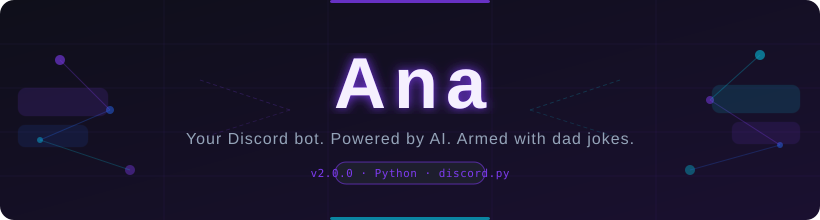
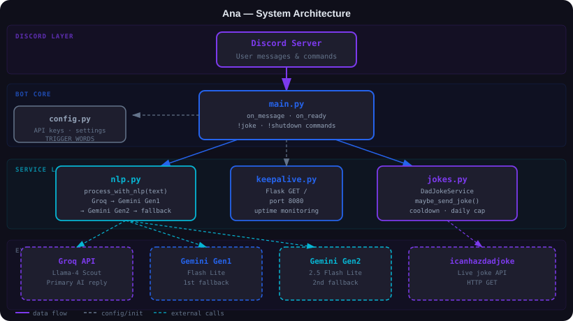
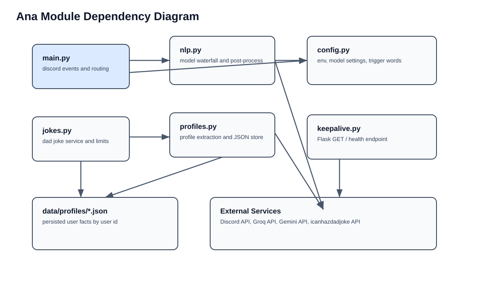
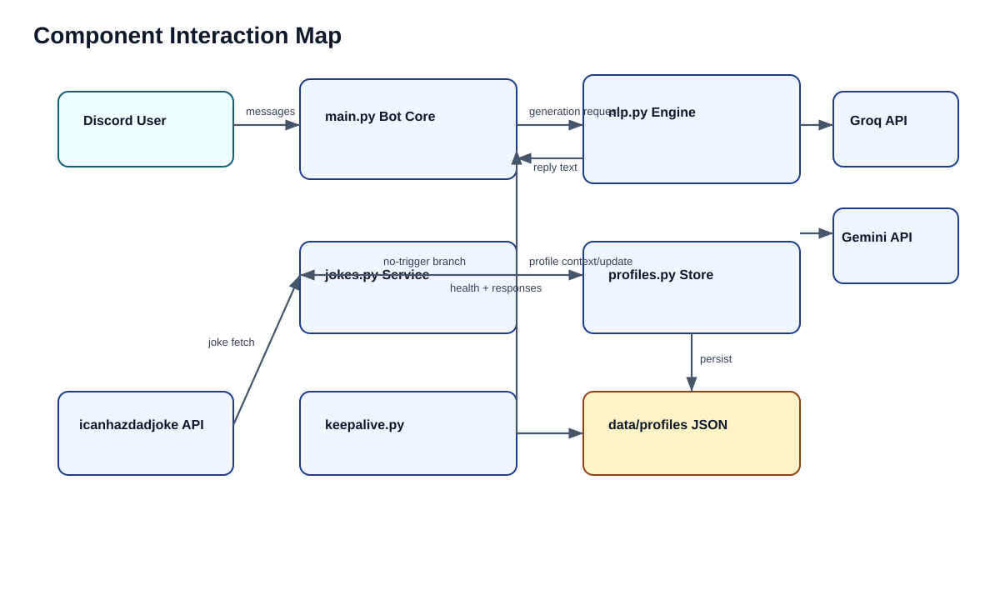
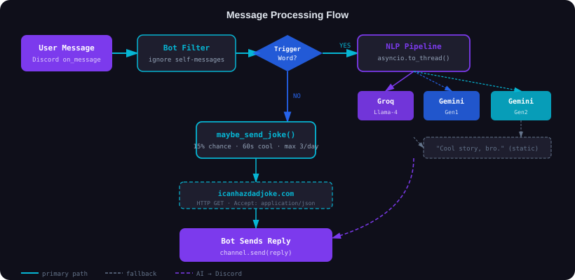
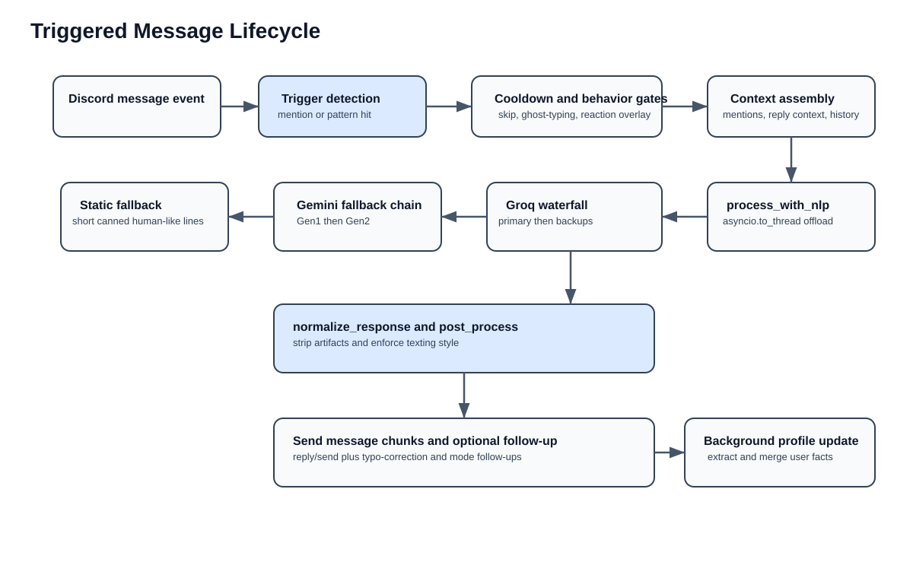
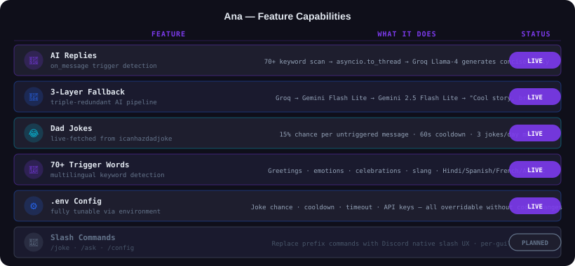
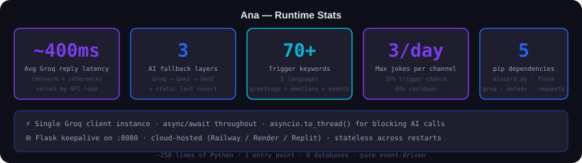

<!-- markdownlint-disable MD032 MD033 MD041 -->
<div align="center">



</div>

# Ana

Ana is a Discord chatbot that acts less like a helpdesk macro and more like an online person with timing, mood, and occasional restraint.

Under the hood, it is a single Python runtime with:
- `discord.py` event handling
- a multi-stage AI fallback pipeline
- per-channel short-term memory
- per-user profile extraction and persistence
- a keepalive HTTP endpoint for hosting platforms that distrust silence

## Table of Contents

- [Ana](#ana)
  - [Table of Contents](#table-of-contents)
  - [System Overview](#system-overview)
  - [Architecture](#architecture)
    - [Module Dependency Diagram](#module-dependency-diagram)
    - [Component Interaction Diagram](#component-interaction-diagram)
  - [Data Flow](#data-flow)
    - [Request Lifecycle Diagram](#request-lifecycle-diagram)
  - [Module Breakdown](#module-breakdown)
    - [`main.py`](#mainpy)
    - [`nlp.py`](#nlppy)
    - [`profiles.py`](#profilespy)
    - [`jokes.py`](#jokespy)
    - [`config.py`](#configpy)
    - [`keepalive.py`](#keepalivepy)
  - [Dependencies](#dependencies)
  - [Configuration Reference](#configuration-reference)
  - [API Reference](#api-reference)
    - [Discord command surface](#discord-command-surface)
    - [Event surface](#event-surface)
    - [HTTP surface](#http-surface)
    - [Internal callable interfaces](#internal-callable-interfaces)
  - [Setup](#setup)
  - [Usage Examples](#usage-examples)
    - [Normal trigger](#normal-trigger)
    - [Roast mode](#roast-mode)
    - [Flirt mode](#flirt-mode)
    - [Joke command](#joke-command)
  - [Developer Guide](#developer-guide)
  - [Troubleshooting](#troubleshooting)
  - [Performance Considerations](#performance-considerations)
    - [Visualization Graphs](#visualization-graphs)
  - [Validation Notes](#validation-notes)

## System Overview

Ana processes Discord message events and decides whether to:
1. ignore,
2. react,
3. reply,
4. run a roast/flirt mode,
5. send a random dad joke on non-trigger traffic,
6. update a per-user profile in the background.

Core execution traits implemented in code:
- user cooldown: 25 seconds
- channel cooldown: 7 seconds
- low-signal skip: 5 percent
- ghost-typing: 6 percent
- reaction overlay on text reply: 10 percent
- typo injection: 4 percent (70 percent chance of correction follow-up)
- follow-up probabilities: roast 25 percent, flirt 20 percent, normal 8 percent

## Architecture



Ana runs in one process with two execution contexts:
- main async context: Discord gateway, command handling, message pipeline
- daemon thread: Flask keepalive server on port `8080`

The AI call path is intentionally offloaded with `asyncio.to_thread(...)` so HTTP model calls do not block Discord event processing.

### Module Dependency Diagram



### Component Interaction Diagram



## Data Flow



### Request Lifecycle Diagram



End-to-end triggered request flow:
1. `main.py:on_message` receives message.
2. mention/roast/flirt/trigger detection runs via precompiled regex patterns.
3. cooldown and behavior gates run.
4. message text is context-enriched:
   - mention tokens resolved to display names
   - optional reply-thread context injected
   - channel history appended
5. `nlp.process_with_nlp(...)` executes in worker thread.
6. Groq waterfall attempts models in priority order.
7. if Groq fails: Gemini Gen1 then Gemini Gen2.
8. if all providers fail: static short fallback response list.
9. output is normalized and post-processed for style cleanup.
10. response is sent in one or multiple chunks.
11. optional mode-specific follow-up is sent.
12. profile extraction task runs asynchronously and updates JSON profile store.

## Module Breakdown

### `main.py`

Responsibilities:
- Discord bot bootstrap and event loop wiring
- command handlers: `!joke`, `!shutdown`
- trigger mode selection (normal, roast, flirt)
- cooldown and behavior simulation gates
- message history maintenance (`deque(maxlen=20)` per channel)
- asynchronous NLP dispatch with typing/read-delay simulation
- optional follow-up line scheduling
- background profile extraction task creation

### `nlp.py`

Responsibilities:
- prompt assembly for normal/roast/flirt modes
- profile-access classifier using backup Groq key path
- Groq model waterfall execution with per-model settings
- Gemini fallback execution
- response normalization (`normalize_response`)
- artifact stripping and style cleanup (`post_process`)

Default model sequence from config:
- `moonshotai/kimi-k2-instruct`
- `llama-3.1-8b-instant`
- `llama-3.1-8b-instant` (deduped at runtime)
- `qwen/qwen3-32b`

Fallback chain:
- `gemini-1.5-flash-latest`
- `gemini-2.5-flash-lite`
- static fallback responses

### `profiles.py`

Responsibilities:
- per-user profile file resolution and caching
- deep-merge of extracted structured facts
- thread-safe file update with atomic replace
- compact profile context formatting for prompt injection
- Gemini-based personal fact extraction (`extract_profile_info`)

Persistence model:
- path: `data/profiles/*.json`
- includes internal fields `_id`, `_name`
- stores extracted public facts and preferences

### `jokes.py`

Responsibilities:
- fetch live jokes from configured endpoint
- enforce random chance, cooldown, and daily cap
- wrap send behavior with typing simulation and intro/outro variants

Implemented constraints:
- default chance: `0.15`
- default cooldown: `60s`
- daily cap: `3`

### `config.py`

Responsibilities:
- load environment variables with `load_dotenv(override=True)`
- parse typed numeric env values
- expose trigger, roast, flirt word sets
- expose joke settings dataclass
- expose model waterfall overrides and per-model generation settings

### `keepalive.py`

Responsibilities:
- Flask app serving `GET /` => `Bot is alive!`
- daemon thread launch for host uptime probes

## Dependencies

Runtime dependencies from `requirements.txt`:
- `discord.py>=2.3.2`
- `flask>=3.0.0`
- `python-dotenv>=1.0.0`
- `requests>=2.32.0`
- `groq>=1.0.0`

## Configuration Reference

All configuration is env-driven.

Required for baseline operation:
- `DISCORD_TOKEN`
- `GROQ_API_KEY` (recommended for primary model path)

Optional but important:
- `GROQ_BACKUP_API_KEY` (reserved for profile-access classifier path)
- `GEN1_API_KEY` and `GEN2_API_KEY` (Gemini fallback and profile extraction)
- `SYSTEM_PROMPT` (inline prompt override)
- `CHARACTER_PROFILE_PATH` (file-based prompt source override)
- `JOKE_CHANCE`
- `JOKE_COOLDOWN`
- `JOKE_FETCH_TIMEOUT`
- `JOKE_API_URL`
- `GROQ_MODEL_PRIMARY`
- `GROQ_MODEL_BACKUP1`
- `GROQ_MODEL_BACKUP2`
- `GROQ_MODEL_BACKUP3`

Environment template is provided in `.env.example`.

## API Reference

### Discord command surface

- `!joke`: force joke fetch and send
- `!shutdown`: owner-only graceful shutdown

### Event surface

- `on_ready`: startup log and cleanup-task activation
- `on_message`: full request decision tree

### HTTP surface

- `GET /` on `keepalive.py`: health probe response `Bot is alive!`

### Internal callable interfaces

- `process_with_nlp(...)`
- `call_groq(...)`
- `call_gemini(...)`
- `normalize_response(...)`
- `post_process(...)`
- `extract_profile_info(...)`
- `ProfileStore.update(...)`
- `DadJokeService.maybe_send_joke(...)`

## Setup

1. Clone repository.
2. Create virtual environment.
3. Install dependencies.
4. Copy `.env.example` to `.env` and fill values.
5. Run `python main.py`.

Example:

```bash
git clone https://github.com/Kaelith69/Ana.git
cd Ana
python -m venv .venv
# Windows
.venv\Scripts\activate
# Linux/macOS
# source .venv/bin/activate
pip install -r requirements.txt
copy .env.example .env   # Windows
# cp .env.example .env   # Linux/macOS
python main.py
```

## Usage Examples

### Normal trigger

```text
User: hey ana
Ana: hey what's up
```

### Roast mode

```text
User: ana ur so mid
Ana: imagine saying that and expecting impact
```

### Flirt mode

```text
User: ana ur kinda cute
Ana: careful i might start believing u
```

### Joke command

```text
User: !joke
Ana: okay don't judge me
Ana: <dad joke from API>
```

## Developer Guide

Recommended local checks:

```bash
python -m compileall .
python smoke_test.py
python -c "import config, jokes, profiles, nlp, keepalive, main; print('imports-ok')"
```

Wiki references:
- `wiki/Home.md`
- `wiki/Architecture.md`
- `wiki/Installation.md`
- `wiki/Usage.md`
- `wiki/API-Reference.md`
- `wiki/Developer-Guide.md`
- `wiki/Privacy.md`
- `wiki/Troubleshooting.md`
- `wiki/Roadmap.md`

## Troubleshooting

- startup succeeds but no reply:
  - verify Message Content intent
  - verify channel permissions
  - verify trigger words
- keys look valid but runtime still fails:
  - confirm `.env` values are current
  - restart process after edits
  - run `python smoke_test.py`
- keepalive not responding:
  - check port `8080` availability
  - verify keepalive thread startup

## Performance Considerations

- event-loop safety:
  - blocking calls are offloaded via `asyncio.to_thread`
- bounded in-memory state:
  - per-channel history uses fixed `deque(maxlen=20)`
  - periodic cleanup task prunes stale cooldown keys
- external API resilience:
  - waterfall and fallback chain reduce hard failure rates
- output normalization:
  - deterministic cleanup reduces LLM artifact leakage without extra API calls
- write-path safety:
  - profile writes use temp file + atomic replace

### Visualization Graphs





